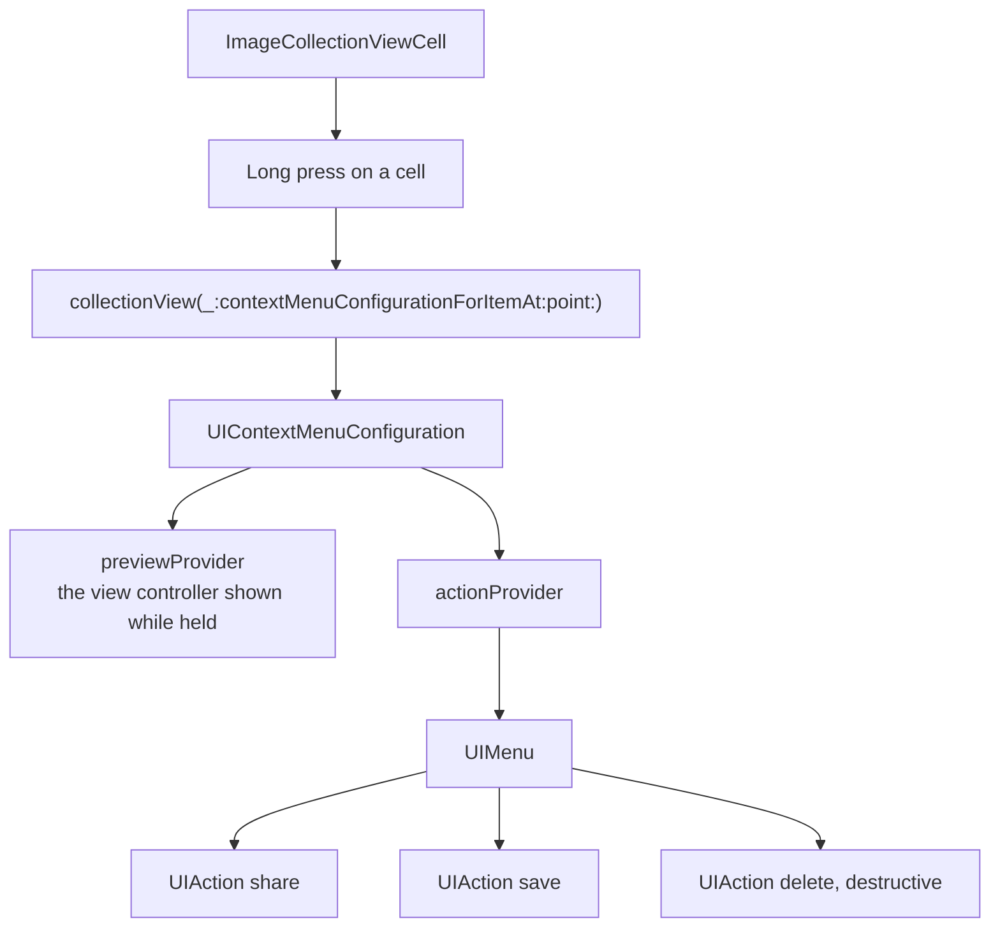

# Collection View Context Menu

*Long press context menus with a preview, on a grid of images.*

    

## Overview

Holding a cell raises it into a preview with a menu of actions beneath. The API involved is `contextMenuConfigurationForItemAt`, which asks for a configuration made of an optional preview provider and an action provider.

## How it works



## Implementation notes

- **Identifier per item.** The configuration is created with the index path as its identifier, which is how the system matches the preview to the cell it animates from.
- **Destructive actions marked.** Passing the destructive attribute is what renders the delete entry in red, rather than styling it manually.
- **Preview is optional.** Returning nil for the preview provider still yields a menu, and the cell itself is used as the preview.
- **Flow layout is enough.** The grid uses a plain flow layout, keeping the example focused on the menu rather than on layout.

## Project structure

```
CollectionViewContextMenu/
├── ViewController.swift              grid and menu configuration
└── ImageCollectionViewCell.swift
```

## Requirements

Xcode 15 or later, iOS 17.5 or later. No external dependencies.
